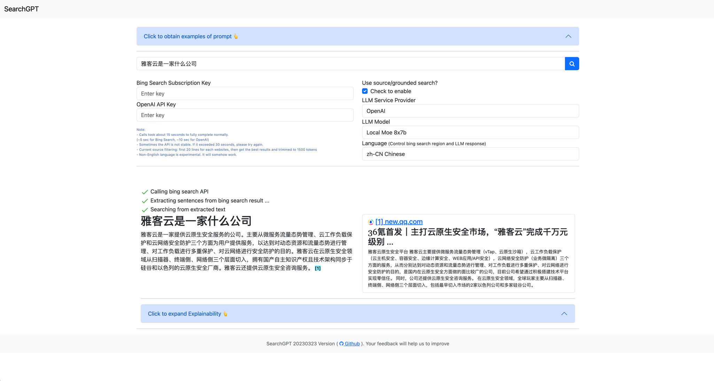

searchGPT - An Open-Source LLM-based Grounded Search Engine
==================================================


Update
---------

```bash
        modified:   README.md
        modified:   src/LLMService.py
        modified:   src/NLPUtil.py
        modified:   src/SearchGPTService.py
        modified:   src/SemanticSearchService.py
        modified:   src/config/config.yaml
        modified:   src/website/templates/index.html

```

* add Env `LOCAL_LLM` to use local LLM model (default: `None`)
* support llama.cpp server for local LLM model
* modify llama.cpp `cd llama.cpp && vim examples/server/server.cpp && make`
* 
* start llama server

```bash
  server  --threads 8 -ngl 100  -c 4096 -a moe-8x7 -m lumosia-moe-4x10.7.Q4_K_M.gguf --embedding
   ```


* Demo page
  * https://searchgpt-demo.herokuapp.com/index
  * Please remain only UI search and don't call it with a program.
  * Please be patient for the search loading time, which usually need ~10 seconds



**searchGPT** is an open-source project to build a search engine based on Large Language Model (LLM) technology to give natural language answers.

You may consider that this is a **minimal implementation of new Bing mainly for search engine and question answering**. 

It supports using sources like the Internet and supports file content search.

Please give me a star if you like it! 🌟


### Installation

1. Create your python or anaconda env and install python packages

Native
```
# using python=3.10.8
pip install -r requirements.txt
```

Anaconda
```
conda create --name searchgpt python=3.10.8
conda activate searchgpt
pip install -r requirements.txt
```

2. Input API keys (OpenAI/Azure Bing Search) in `src/config/config.yaml` (or using UI)
3. Run `app.py`, (or `flask_app.py`) for frontend web app launching. `main.py` for stdout output only.

# Acknowledgments

I would like to express my sincere gratitude to the `searchGPT` project and its contributors for their exceptional work. The `searchGPT` project, available at [michaelthwan/searchGPT](https://github.com/michaelthwan/searchGPT), has been a valuable resource and inspiration for the development of my own project. The innovative approach and robust implementation have provided insights and a solid foundation that have greatly contributed to my work.

Special thanks to [Michael Thwan](https://github.com/michaelthwan) for creating and maintaining the `searchGPT` project. Your dedication to open-source development and community engagement is truly commendable.

This acknowledgment serves as a token of appreciation for the shared knowledge and collaborative spirit that the open-source community embodies. Thank you for your contributions to the field and for supporting fellow developers like myself.
